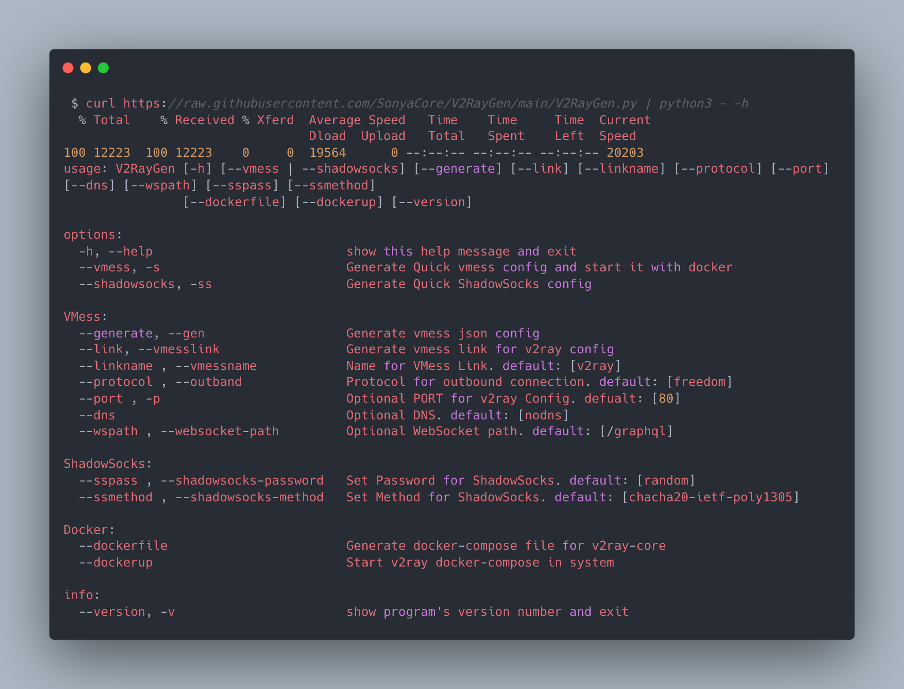
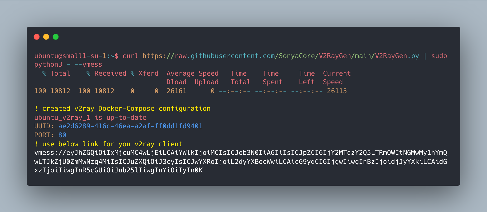
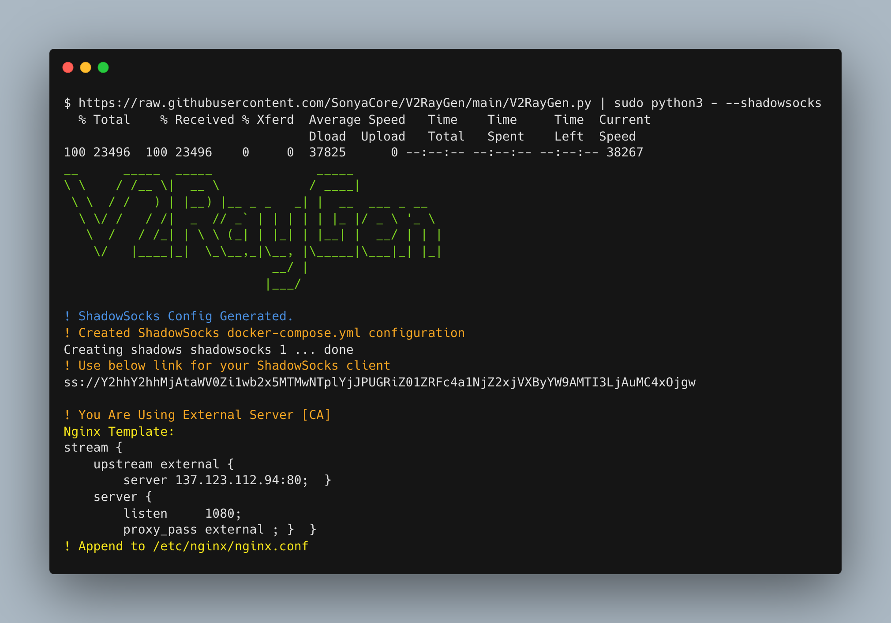

<h1 align="center"> V2RayGen

[![Contributors][contributors-shield]][contributors-url]
[![Forks][forks-shield]][forks-url]
[![Stargazers][stars-shield]][stars-url]
[![Issues][issues-shield]][issues-url]
[![Telegram][telegram-shield]][telegram-url]
</h1>

<h3>
V2RayGen is a fully automated script that helps you to set up your own v2ray server in the fastest time.

</h3>

  [**Usage**](#usage)
  
  [**QuickSetup**](#quicksetup)
  
  [**Options**](#options)
  
  [**License**](#license)

## **Prerequisites & Dependencies**
For running this script, you must have **docker**, **docker-compose** and **python3** on your server **but** this script installs docker & docker-compose if your server doesn't have docker and runs v2ray-core automatically

## **Usage**

`curl https://raw.githubusercontent.com/SonyaCore/V2RayGen/main/V2RayGen.py | python3 - -h`

<br>



<br>


## QuickSetup

### **Quick `VMess` Setup with Default Setting** :

```bash
curl https://raw.githubusercontent.com/SonyaCore/V2RayGen/main/V2RayGen.py | sudo python3 - --vmess
```
OR

```bash
curl https://raw.githubusercontent.com/SonyaCore/V2RayGen/main/V2RayGen.py --output V2RayGen.py
sudo python3 V2RayGen.py --vmess
```



> for changing port simply use --port <int>

### **Quick `ShadowSocks` Setup with Default Setting** :

```bash
curl https://raw.githubusercontent.com/SonyaCore/V2RayGen/main/V2RayGen.py | sudo python3 - --shadowsocks
```




## **Options**

**Supported DNS providers:**
> use `--dns` to set one of below dns's for.

|DNS                |
|-------------------|
|google             |
|cloudflare         |
|opendns            |
|quad9              |
|adguard            |

> https://www.v2ray.com/en/configuration/dns.html


**Supported Outband Protocols:**
> use `--generate --outband` to set one of below protocols.

|Outband  Protocols |
|-------------------|
|Freedom|           |
|BlackHole          |
|Freedom + BlackHole|

> https://www.v2ray.com/en/configuration/protocols.html

 <br>

### **Custom JSON header**

#### `--header` argument are used for load custom header file 

#### **Default Template for JSON HTTPRequest header**

> Visit below site for HTTPRequest Object :
 https://www.v2ray.com/en/configuration/transport/tcp.html#httprequestobject

> Make sure your header file look like the below JSON :
```
{
  "header": {
    "type": "http",
    "response": {
      "version": "1.1",
      "status": "200",
      "reason": "OK",
      "headers": {
        "Content-Type": [
          "application/octet-stream",
          "application/x-msdownload",
          "text/html",
          "application/x-shockwave-flash"
        ],
        "Transfer-Encoding": ["chunked"],
        "Connection": ["keep-alive"],
        "Pragma": "no-cache"
      }
    }
  }
}
```
### Link formats : 
#### VMess :
```json
vmess://{"add":"ip / domain ","aid":"alterid","host":"","id":"random-uuid","net":"ws","path":"websocket-path","port":"80","ps":"linkname","tls":"","type":"none","v":"2" }
```
#### ShadowSocks :
```json
ss://shadowsocks-security-method:random-uuid@domain/ip :port
```

## License
Licensed under the [GPL-3][LICENSE] license.

<!-- MARKDOWN LINKS & IMAGES -->
<!-- https://www.markdownguide.org/basic-syntax/#reference-style-links -->

[contributors-shield]: https://img.shields.io/github/contributors/SonyaCore/V2RayGen?style=flat
[contributors-url]: https://github.com/SonyaCore/V2RayGen/graphs/contributors
[forks-shield]: https://img.shields.io/github/forks/SonyaCore/V2RayGen?style=flat
[forks-url]: https://github.com/SonyaCore/V2RayGen/network/members
[stars-shield]: https://img.shields.io/github/stars/SonyaCore/V2RayGen?style=flat
[stars-url]: https://github.com/SonyaCore/V2RayGen/stargazers
[issues-shield]: https://img.shields.io/github/issues/SonyaCore/V2RayGen?style=flat
[issues-url]: https://github.com/SonyaCore/V2RayGen/issues
[telegram-shield]: https://img.shields.io/badge/Telegram-blue.svg?style=flat&logo=telegram
[telegram-url]: https://t.me/ReiNotes
[LICENSE]: LICENCE
