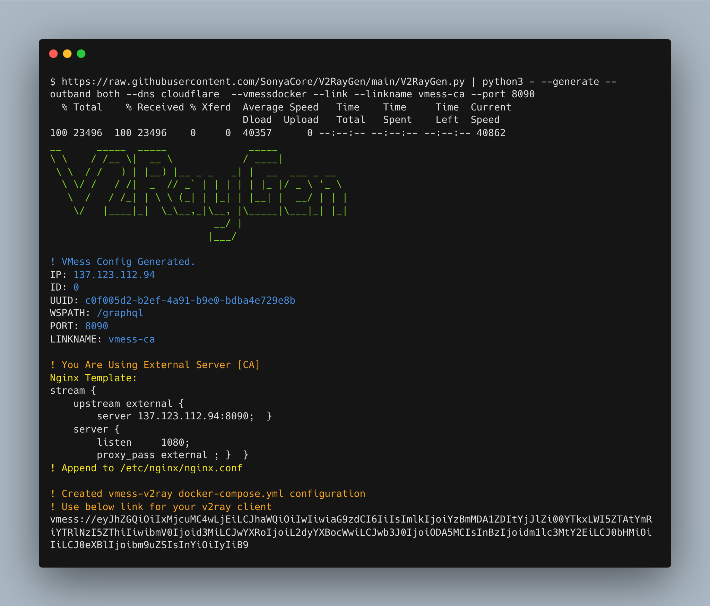

<h1 align="center"> V2RayGen

[![Contributors][contributors-shield]][contributors-url]
[![Forks][forks-shield]][forks-url]
[![Stargazers][stars-shield]][stars-url]
[![Issues][issues-shield]][issues-url]
[![Telegram][telegram-shield]][telegram-url]
</h1>

<p>
V2RayGen is a fully automated script that helps you to set up your own v2ray server in the fastest time.
</p>

## Prerequisites & Dependencies
For running this script, you must have **docker**, **docker-compose** and **python3** installed on your server **or** you can use `--dockerup` switch which installs docker & docker-compose and runs v2ray-core automatically

## Usage

`curl https://raw.githubusercontent.com/SonyaCore/V2RayGen/main/V2RayGen.py | python3 - -h`


### Quick VMess Setup with Default Setting :

```bash
curl https://raw.githubusercontent.com/SonyaCore/V2RayGen/main/V2RayGen.py | sudo python3 - --vmess
```
Or

```bash
curl https://raw.githubusercontent.com/SonyaCore/V2RayGen/main/V2RayGen.py --output V2RayGen.py
sudo python3 V2RayGen.py --vmess
```


> for changing port simply use --port <int>

### Quick ShadowSocks Setup with Default Setting :

```bash
curl https://raw.githubusercontent.com/SonyaCore/V2RayGen/main/V2RayGen.py | sudo python3 - --shadowsocks
```
OR 
### Quick ShadowSocks-OBFS Setup with Default Setting :
```bash
curl https://raw.githubusercontent.com/SonyaCore/V2RayGen/main/V2RayGen.py | sudo python3 - --obfs
```


### Advanced Method :

```bash
curl https://raw.githubusercontent.com/SonyaCore/V2RayGen/main/V2RayGen.py | sudo python3 - --generate --protocol both --dns cloudflare --dockerfile --dockerup --link --linkname vmess-ca --port 8090
```



**Supported DNS providers:**
|DNS                |
|-------------------|
|google             |
|cloudflare         |
|opendns            |
|quad9              |
|adguard            |
 
**Supported Outband Protocols:**
|Outband  Protocols |
|-------------------|
|Freedom|           |
|BlackHole          |
|Freedom + BlackHole|


 
---
  
### Todo List

- [x] ShadowSocks JSON Template
- [x] Adding more options for changing configuration
- [x] Catch Errors if Error Occured
- [ ] More Exception Error Handeling
- [ ] Add Verbose Mode With Logger


<!-- MARKDOWN LINKS & IMAGES -->
<!-- https://www.markdownguide.org/basic-syntax/#reference-style-links -->

[contributors-shield]: https://img.shields.io/github/contributors/SonyaCore/V2RayGen?style=for-the-badge
[contributors-url]: https://github.com/SonyaCore/V2RayGen/graphs/contributors
[forks-shield]: https://img.shields.io/github/forks/SonyaCore/V2RayGen?style=for-the-badge
[forks-url]: https://github.com/SonyaCore/V2RayGen/network/members
[stars-shield]: https://img.shields.io/github/stars/SonyaCore/V2RayGen?style=for-the-badge
[stars-url]: https://github.com/SonyaCore/V2RayGen/stargazers
[issues-shield]: https://img.shields.io/github/issues/SonyaCore/V2RayGen?style=for-the-badge
[issues-url]: https://github.com/SonyaCore/V2RayGen/issues
[telegram-shield]: https://img.shields.io/badge/Telegram-blue.svg?style=for-the-badge&logo=telegram
[telegram-url]: https://t.me/ReiNotes
