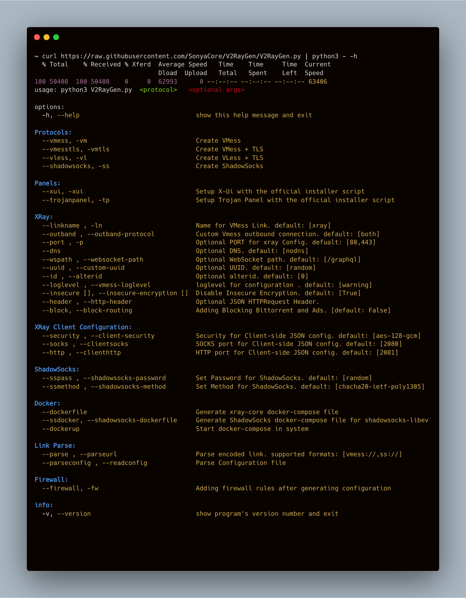

<h1 align="center"> XRayGen

[![Contributors][contributors-shield]][contributors-url]
[![Forks][forks-shield]][forks-url]
[![Stargazers][stars-shield]][stars-url]
[![Issues][issues-shield]][issues-url]
[![Telegram][telegram-shield]][telegram-url]

</h1>

<h3>
<strong>V2RayGen / XRayGen</strong> is a fully automated script that helps you to set up your own Xray server in the fastest time.
</h3>

[**Usage**](#usage)

[**Quick Setup**](#quicksetup)

[**Examples**](#examples)

[**Options ⚙️**](#options)

[**License 🪪**](#license)

[**Donate Me ☕**](#donateme)

## **Prerequisites & Dependencies**

For running this script, you must have **docker**, **docker-compose** and **python3** on your server **but** this script installs `docker` & `docker-compose` if your server doesn't have docker and runs xray-core automatically

use **sudo** if your current user is not in the docker group or you don't have docker installed

## **How XRayGen Works ?**

`XRayGen` uses docker to pull XRay image from the docker registry and after that, it generates a configuration file to start XRay container.

it also creates a client side configuration file so you can use that with xray-core or v2ray-core.

There is also `XRayAgent` for User Management on XRay Configuration which can be used for CRUD operations.

## **Usage**

`curl https://raw.githubusercontent.com/SonyaCore/V2RayGen/main/V2RayGen.py | python3 - -h`



<br>

## **QuickSetup**

You can use one of the following protocols for installation and change its settings according to your needs.

| Protoctol   | Argument            |
| ----------- | ------------------- |
| VMESS       | --vmess , -wm       |
| VMESS + TLS | --vmesstls , -vmtls |
| VLESS + TLS | --vless , -vl       |

### **Quick `Xray` Setup with Default Setting** :

```bash
curl https://raw.githubusercontent.com/SonyaCore/V2RayGen/main/V2RayGen.py | sudo python3 - --vmess
```

OR

```bash
curl https://raw.githubusercontent.com/SonyaCore/V2RayGen/main/V2RayGen.py --output V2RayGen.py
sudo python3 V2RayGen.py --vmess
```


after installation use the provided link to your client or use the client-side json configuration with xray-core or v2ray-core

if your server is on the domain after importing the link to your v2ray client simply change the IP to your domain or subdomain

# **Examples**

**Setup XRAY / ShadowSocks :**

VLESS + TLS :

```bash
curl https://raw.githubusercontent.com/SonyaCore/V2RayGen/main/V2RayGen.py | sudo python3 - --vless
```

VMESS + TLS with blocking option :

```bash
curl https://raw.githubusercontent.com/SonyaCore/V2RayGen/main/V2RayGen.py | sudo python3 - --vmesstls --block
```

VMESS + Changing client-side HTTP and SOCKS port :

```bash
curl https://raw.githubusercontent.com/SonyaCore/V2RayGen/main/V2RayGen.py | sudo python3 - --vmess --http 4020 --socks 8080
```

VLESS + Using Google DNS :

```bash
curl https://raw.githubusercontent.com/SonyaCore/V2RayGen/main/V2RayGen.py | sudo python3 - --vless --dns google
```

ShadowSocks + adding shadowsocks port to server :

```bash
curl https://raw.githubusercontent.com/SonyaCore/V2RayGen/main/V2RayGen.py | sudo python3 - --shadowsocks --firewall
```

**Parsing Configuration :**

Parse & reading Configuration file :

```bash
curl https://raw.githubusercontent.com/SonyaCore/V2RayGen/main/V2RayGen.py | python3 - --parseconfig config.json
```

Parse URL and read information :

```bash
curl https://raw.githubusercontent.com/SonyaCore/V2RayGen/main/V2RayGen.py | python3 -  --parse vmess://eyJhZGQiOiIxMjcuMC4wLjEiLCJhaWQiOiIwIiwiaG9zdCI6IiIsImlkIjoiM2JlNjE2NzktOGQzOC00ZWJiLWJjOGItMTQ4ZjE0ZWY5ZTc3IiwibmV0Ijoid3MiLCJwYXRoIjoiL2dyYXBocWwiLCJwb3J0IjoiNDQzIiwicHMiOiJ4cmF5IiwidGxzIjoidGxzIiwidHlwZSI6Im5vbmUiLCJ2IjoiMiIgfQ==
```

---

# **XRayAgent**

XRayAgent is a Simple User Management for XRay Configuration

> XRayAgent takes user input so you have to download that to your server and then running it

### Download Script & Run With Python3:

```bash
curl https://raw.githubusercontent.com/SonyaCore/V2RayGen/main/XRayAgent.py --output XRayAgent.py
python3 XRayAgent.py
```

> By default it loads `config.json` for loading configuration

> For loading other configuration simply enter the name of the configuration after XRayAgent.py :

```bash
python3 XRayAgent.py config.json
```

## XRayAgent Commands :

```python3
  add, adduser         adding user
  update, updateuser   update existing user with their index ID
  del, deluser         delete existing user with ther index ID
  users, listusers     list of users
  p, port              change server side port
  h, help              get help
  v, version           get version of program
  q, quit              exit program
```

after adding an user a index will be created for that user for example :

```bash
Index : 0 {'id': '25ad6df8-9a54-4f6e-8c44-d5685359a7ce', 'level': 0, 'email': 'example@example.com'}
Index : 1 {'id': '62bf2d5d-766b-4281-963a-544449a26b4f', 'level': 0, 'email': 'cLkx4WC0@protonmail.com'}
```

and now you can update that user with ther index ID :

```python3
cmd > : update 1
Index 1 Selected
Leave the section empty if you don't want to modify that section
New Email : test@gmail.com
New ID : 62bf2d5d-766b-4281-963a-544449a26b4f
Index 1 Updated
vless://62bf2d5d-766b-4281-963a-544449a26b4f@127.0.0.1:443?path=/graphql&security=tls&encryption=none&type=ws#xray
```

> Use Index ID for `update` , `del`

> For Showing list of Users and their Indexs use `users` or `listusers` command

---

# **Options**

## Server Side

you can change server-side configuration with below options :

`linkname` for changing linkname after generating configuration.

`port` for changing configuration port.

`dns` for using custom dns instead system's default dns configuration.

`wspath` for changing default WebSocket path configuration.

`uuid` for using custom uuid configuration.

`id` custom alterID.

`loglevel` using another loglevel for configuration insted of [warning].

`header` for using custom header configuration.

`block` for adding blocking Bittorrent and Ads.

---

## Client Side

after generating the configuration with desired protocol client-side configuration is also generated as well

you can use client-side configuration directly with xray-core or v2ray-core

`security` security method for client-side configuration.

`socks` client-side SOCKS port . default: [2080]

`http` client-side HTTP port . default: [2081]

---

## Parsing Configuration

for parsing existed configuration or decoding vmess url use below options :

`parse` for parsing encoded link. supported formats are [vmess://,ss://]

`parseconfig` for reading the configuration file and parsing information

---

**Supported DNS providers:**

> use `--dns` to set one of below dns's.

| DNS        |
| ---------- |
| google     |
| cloudflare |
| opendns    |
| quad9      |
| adguard    |

> https://www.v2ray.com/en/configuration/dns.html

#### **Supported Outband Protocols:**

> use `--outband` to set one of below protocols.

| Outband Protocols   |
| ------------------- |
| Freedom             |
| BlackHole           |
| Freedom + BlackHole |

> https://www.v2ray.com/en/configuration/protocols.html

### **Custom JSON header**

#### `--header` argument are used for load custom header file

#### **Default Template for JSON HTTPRequest header**

> Visit below site for HTTPRequest Object :
> https://www.v2ray.com/en/configuration/transport/tcp.html#httprequestobject

> `Make sure your header file look like the below JSON` :

```
{
  "header": {
    "type": "http",
    "response": {
      "version": "1.1",
      "status": "200",
      "reason": "OK",
      "headers": {
        "Content-Type": [
          "application/octet-stream",
          "application/x-msdownload",
          "text/html",
          "application/x-shockwave-flash"
        ],
        "Transfer-Encoding": ["chunked"],
        "Connection": ["keep-alive"],
        "Pragma": "no-cache"
      }
    }
  }
}
```

## Link formats :

#### `VMess` :

```json
vmess://{"add":"ip / domain ","aid":"alterid","host":"","id":"random-uuid","net":"ws","path":"websocket-path","port":"80","ps":"linkname","tls":"","type":"none","v":"2" }
```

#### `VLess` :

```json
vless://random-uuid@ip:port?path=websocketpath&security=type&encryption=none&type=ws#linkname
```

#### `ShadowSocks` :

```json
ss://shadowsocks-security-method:random-uuid@domain/ip :port
```

## DonateMe

If this Project helped you, you can also help me by donation

### ![tron-button] &nbsp; TTTo7aasobgqH5pKouCJfmPYn2KLed2RA3

### ![bitcoin-button] &nbsp; bc1qgdav05s04qx99mdveuvdt76jauttcwdq687pc8

### ![ethereum-button] &nbsp; 0xD17dF52790f5D6Bf0b29151c7ABC4FFC4056f937

### ![tether-button] &nbsp; 0xD17dF52790f5D6Bf0b29151c7ABC4FFC4056f937

## License

Licensed under the [GPL-3][license] license.

<!-- MARKDOWN LINKS & IMAGES -->
<!-- https://www.markdownguide.org/basic-syntax/#reference-style-links -->

[tron-button]: https://img.shields.io/badge/TRX-Tron-ff69b4
[tether-button]: https://img.shields.io/badge/ERC20-Tether-purple
[bitcoin-button]: https://img.shields.io/badge/BTC-Bitcoin-orange
[ethereum-button]: https://img.shields.io/badge/ETH-Ethereum-blue
[contributors-shield]: https://img.shields.io/github/contributors/SonyaCore/V2RayGen?style=flat
[contributors-url]: https://github.com/SonyaCore/V2RayGen/graphs/contributors
[forks-shield]: https://img.shields.io/github/forks/SonyaCore/V2RayGen?style=flat
[forks-url]: https://github.com/SonyaCore/V2RayGen/network/members
[stars-shield]: https://img.shields.io/github/stars/SonyaCore/V2RayGen?style=flat
[stars-url]: https://github.com/SonyaCore/V2RayGen/stargazers
[issues-shield]: https://img.shields.io/github/issues/SonyaCore/V2RayGen?style=flat
[issues-url]: https://github.com/SonyaCore/V2RayGen/issues
[telegram-shield]: https://img.shields.io/badge/Telegram-blue.svg?style=flat&logo=telegram
[telegram-url]: https://t.me/ReiNotes
[license]: LICENCE
